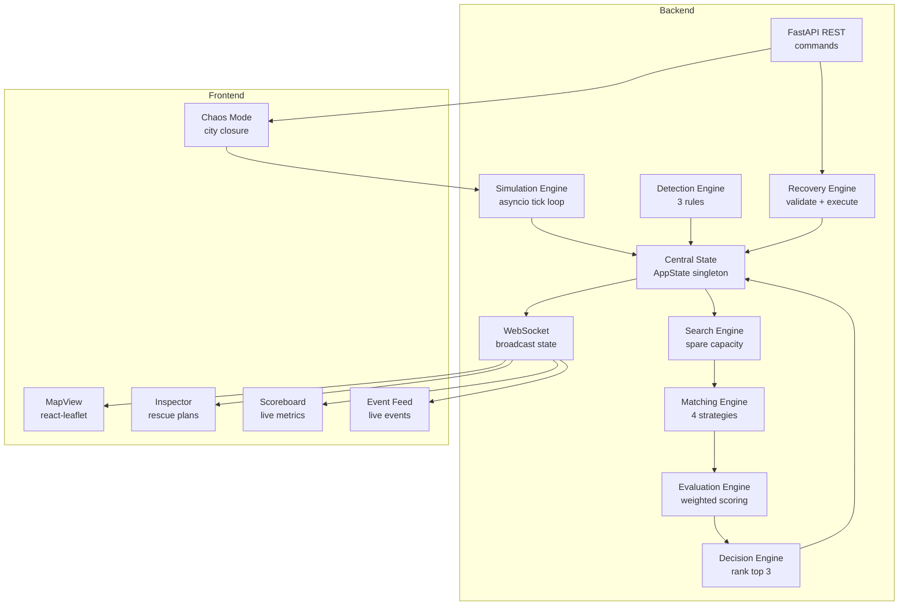

# Architecture

## Overview

RelayAI uses a clean separation between simulation, pipeline (processing), API, and frontend layers. All state is held in-memory by the backend; the frontend is a pure presentation layer that receives state via WebSocket and sends commands via REST API.

## Mermaid Diagram

## Components

### Simulation Engine (`simulation/engine.py`)
- Advances vehicles along routes each tick
- Updates shipment positions based on assigned vehicle
- Completes legs and assignments
- Induces natural anomalies (3 scenarios at 2% rate)

### Detection Engine (`pipeline/detection.py`)
- Rule 1: Stale scan (> 8h since last scan)
- Rule 2: Route deviation (> 50km from planned route)
- Rule 3: Missed connection (vehicle completed leg, package not scanned)
- Idempotent: skips already-flagged shipments

### Search Engine (`pipeline/search.py`)
- Finds vehicles with `spare_capacity_kg > 0`
- Excludes routes containing CLOSED hubs
- Returns vehicle, route, position, spare capacity

### Matching Engine (`pipeline/matching.py`)
- **Direct**: pickup and destination on same route, pickup before destination
- **Consolidation**: shares with another shipment to same destination
- **Multi-hop**: vehicle A → transfer stop → vehicle B → destination
- **Repositioning**: moves to nearest hub with outbound coverage

### Evaluation Engine (`pipeline/evaluation.py`)
- Computes: piggyback cost, dedicated cost, savings, delay, space used, CO2 saved
- Normalizes all metrics to 0–1 across candidate set
- Applies weighted scoring formula
- Handles edge cases: single candidate, all equal, zero denominators

### Decision Engine (`pipeline/decision.py`)
- Sorts by score descending
- Assigns ranks
- Generates plain-English explanations with real values
- Returns top 3

### Recovery Engine (`pipeline/recovery.py`)
- Validates: shipment exists, is MISPLACED, option exists, capacity still available, hubs not closed, deadline still met
- Cancels original assignment, creates recovery assignment
- Updates vehicle capacity, shipment status → RECOVERING
- Updates metrics and event log

### WebSocket (`websocket.py`)
- ConnectionManager tracks active connections
- Broadcasts full state snapshot every tick
- Handles disconnection and cleanup

### Frontend
- **MapView**: react-leaflet with dark CARTO tiles, shows hubs, vehicles, shipments, routes
- **Inspector**: package details, detection reason, rescue plan cards with real metrics
- **Scoreboard**: animated metric updates (money, time, space, CO2, packages rescued)
- **EventFeed**: live scrolling event log from backend
- **ChaosOverlay**: city closure simulation with visual effects
- **Toast**: recovery confirmation with real savings
- **Tour**: 3-step onboarding
